```{r setup, include=FALSE}
options(htmltools.dir.version = FALSE)
knitr::opts_chunk$set(
  out.width = "80%",
  fig.retina = 3,
  cache = FALSE,
  echo = TRUE,
  message = FALSE, 
  warning = FALSE,
  fig.show = TRUE,
  hiline = TRUE
)
```

```{r xaringan-themer, include=FALSE, warning=FALSE}
library(xaringanthemer)
# vignette("template-variables", "xaringanthemer")

style_duo_accent(
  primary_color = "#1DA1F2",
  secondary_color = "#F97B64",
  inverse_header_color = "#000000",
  inverse_text_color = "#FFFFFF",
  title_slide_text_color = "#FFFFFF",
  text_slide_number_color = "#000000",
  text_font_google = google_font("Source Sans Pro", "600"),
  text_font_size = "1.5rem",
  footnote_font_size = "0.6em",
  footnote_position_bottom = "10px",
  footnote_color = "#A9A9A9", 
  colors = c(
  red = "#f34213",
  purple = "#3e2f5b",
  orange = "#ff8811",
  green = "#136f63",
  white = "#FFFFFF",
  blue = "#1DA1F2",
  gray = "#6e6f70",
  black = "#000000"))

```

```{r packages, include=FALSE}
library(tidyverse)
ggplot2::theme_set(ggplot2::theme_light())
```

class: title-slide, center, middle
background-image: url(images/black-bg.jpg)
background-size: cover

<br>
# `r rmarkdown::metadata$title`

## `r rmarkdown::metadata$subtitle`
<br>

### `r rmarkdown::metadata$author` <br>`r rmarkdown::metadata$acatitle`


#### `r format(Sys.Date(), "%d-%m-%Y")` &#183; KTÜ
####  <a href= "mailto:draliguner@yahoo.com", style="color:#1278a3">email</a> - <a href="https://aliguner.com/", style="color:#1278a3">web</a> - <a href="https://twitter.com/AliGunerMD", style="color:#1278a3">twitter</a>  - <a href="https://github.com/AliGunerMD", style="color:#1278a3">github</a> 


---
class: center, middle

.pull-left[
```{r, echo=FALSE,  out.width = "400px", fig.cap= "Global Akademi*"}

```
]

.footnote[
*akademisyenim.com (2012) -> globalakademik.com (2015) -> aliguner.com (2019)  
(Peloton/Pelotonetto)]


--
.pull-right[

```{r, echo=FALSE, out.width = "400px", fig.cap="AcadeMD (2021)"}
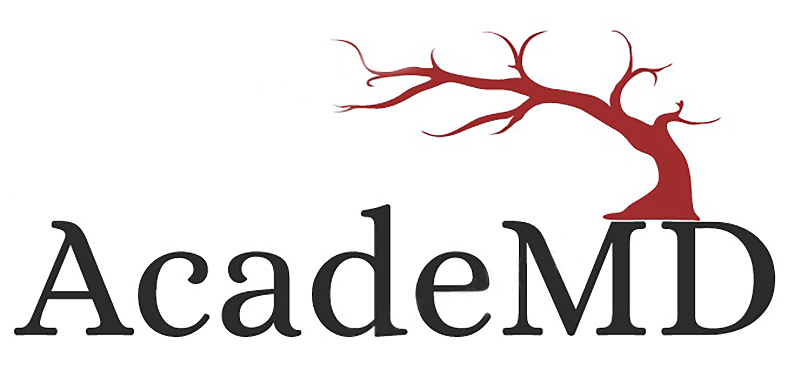
```
]
---
class: center, middle

```{r, echo=FALSE, out.width = "400px"}

```
  
--

Peloton  

--
Journal Club  

--
DataVizMed  

???
deneme 3 5
---
## Neden gerek duydum? [(blog)](https://www.aliguner.com/blog/2018/04/15/neden-gerek-duydum/)

```{r, echo=FALSE, out.width = "400px", fig.cap="", fig.align='center'}
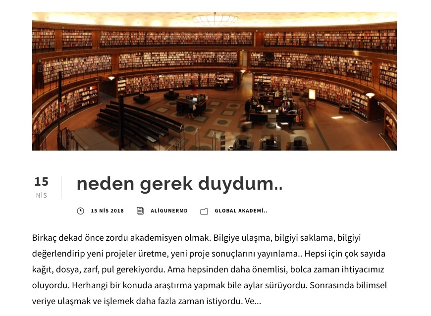

```

--
.pull-left[.center[
#### Mühendislik
      - Lisans
      - Yüksek lisans
      - Doktora
]]

.pull-right[.center[
#### Tıp
      - Lisans
      - Tıpta uzmanlık
      - ....
]]

---
class: middle, center


  
"There is always change, 
life is constantly changing.   
As the world changes, we may not know what to expect on our next path."

---
class:  center, middle

.left-column[


]

.right-column[

]
---
class:  middle, center

.pull-left[

```{r, echo=FALSE, out.width="90%", fig.align='center'}
knitr::include_graphics("images/alphabet.jpg")
```
]

.pull-right[
  
bilim-bilimsel yöntem  
istatistik-biyoistatistik  
Veri tipleri  
Çalışma tipleri  
Çalışma dizaynı  
Hipotez testleri  
p-value  
Effect size  
OR-RR-HR-CI  
SR-MA  
RCT  
Protokol  
(........)  
]

---
class:  middle, center

```{r, echo=FALSE, out.width="50%"}
knitr::include_graphics("images/projectplan.jpg")
```
---
background-image: url(images/letsmove.jpg)
background-position: cover
background-size: 100%
class: top, center, inverse

Let's move

---
background-image: url(images/keynotes/keynotes.002.png)
background-position: bottom
background-size: 55%

#### <u> Bilim </u><sup>1</sup>: **Gözlem ve deney** kullanarak **fiziksel ve doğal dünya**nın **yapısı ve davranışı**nın **sistematik** olarak incelenmesini kapsayan *entellektüel ve pratik faaliyet*


.footnote[
[1] Google dictionary  
[tablo:] Wikipedia]

???

---
class:  middle, center

### Ampirik = Empeirikos
= experienced  
= deneysel bilgi  
= gözlemler sonucu elde edilen bilgi  
= gözlem veya deney yoluyla elde edilen bilgi  
= concerned with by <u>observation or experience</u> rather than theory or pure logic
<br><br><br>
### Formal  
= *teorik* fikirlerle başlayıp ve düşünme süreci sayesinde diğer farklı *teorik* fikirlere ulaşır
---
class: center
.left-column[

]
.right-column[
<br><br><br>
Bilim adamının görevi, <u>önermeler ya da önermeler dizesi</u> ileri sürmek ve bunları sistemli biçimde sınamaktır.
  
Bilim, tümdengelim ile çalışır.
]
.footnote[
[] Karl Raimund Popper
]
---
background-image: url(images/keynotes/keynotes.009.png)
background-size: 80%
class: center
---
background-image: url(images/keynotes/keynotes.010.png)
background-size: 80%
class: center
---
background-image: url(images/keynotes/keynotes.011.png)
background-size: 80%
class: center
---
background-image: url(images/keynotes/keynotes.012.png)
background-size: 80%
class: center
---
background-image: url(images/keynotes/keynotes.013.png)
background-size: 80%
class: center
---
background-image: url(images/keynotes/keynotes.014.png)
background-size: 80%
class: center
---
background-image: url(images/keynotes/keynotes.015.png)
background-size: 80%
class: center
---
background-image: url(images/keynotes/keynotes.016.png)
background-size: 80%
class: center
---
## Plan = ilişkimize isim koyalım!!
```{r, echo=FALSE, out.width="55%", fig.align='center'}
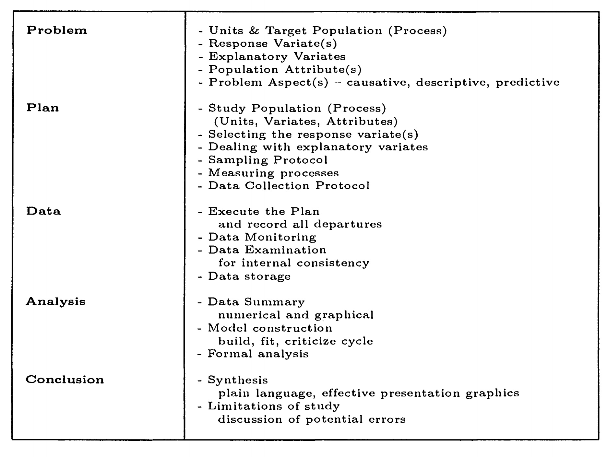
```

.footnote[
full text: [Scientific Method, Statistical Method and the Speed of Light](https://projecteuclid.org/journals/statistical-science/volume-15/issue-3/Scientific-Method-Statistical-Method-and-the-Speed-of/10.1214/ss/1009212817.full) by MacKay RJ, Oldford RW in <u>Statistical Science</u>
]
---
class: center

.pull-left[
## <u>Bilimsel kriterleri</u>  
* Test edilebilir  

* Objektif 

* Tekrarlanabilir  

* Transparan  

* Yanlışlanabilir  

* Tutarlı (iç-dış)    
]
--
.pull-right[
## <u>Diğer</u> 

* Geçici (tentative)  

* Kümülatif  

* Net (clarity)

* Öngörülebilir(Predictable)

* Kullanışlı (usable) 
]
.footnote[
bazı kaynaklar: [Web](https://www.learnreligions.com/criteria-for-science-and-scientific-theories-250570),
[Web](https://www.waldenu.edu/online-masters-programs/ms-in-education/resource/ms-in-education-course-insight-the-six-criteria-of-science),
[Web](https://www.soas.ac.uk/cedep-demos/000_P506_RM_3736-Demo/unit1/page_12.htm),
[Wikipedia](https://en.wikipedia.org/wiki/Scientific_theory)

]
---
### <center> İstatistik - Biyoistatistik  </center>

**Statistics** (not statistic) is the discipline that concerns the <u>collection, organization, analysis, interpretation, and presentation</u> of data.  


```{r, echo=FALSE, out.width="40%", fig.align='center'}
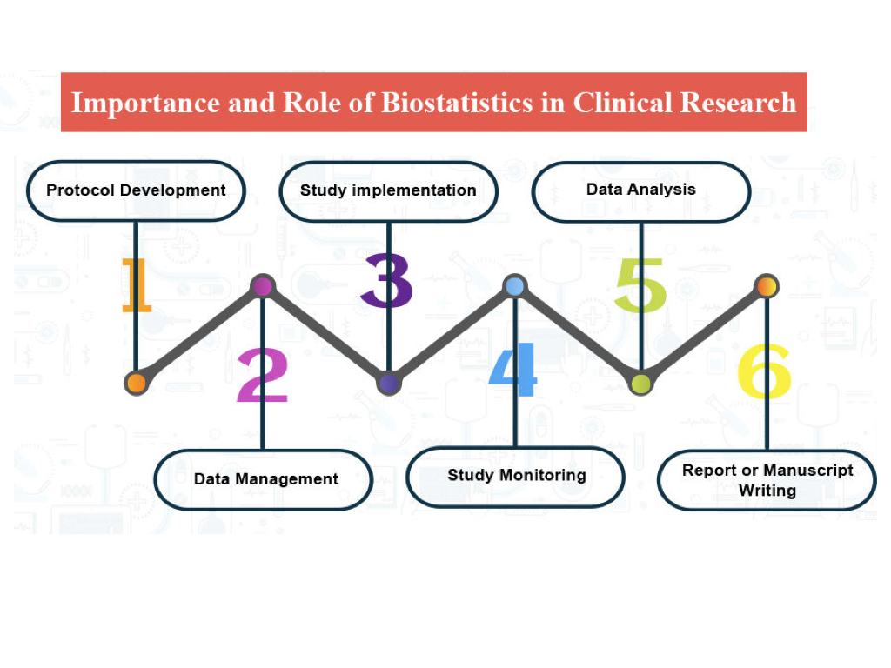
```
--
**Biostatistics** is the development and application of statistical methods to a wide range of topics in <u>biology</u>.
---

#### <u>Statistic</u>: .. for the purpose of inferring proportions in a whole from those **in a representative sample**  

.left-column[
```{r, echo=FALSE, out.width="100%", fig.align='center'}
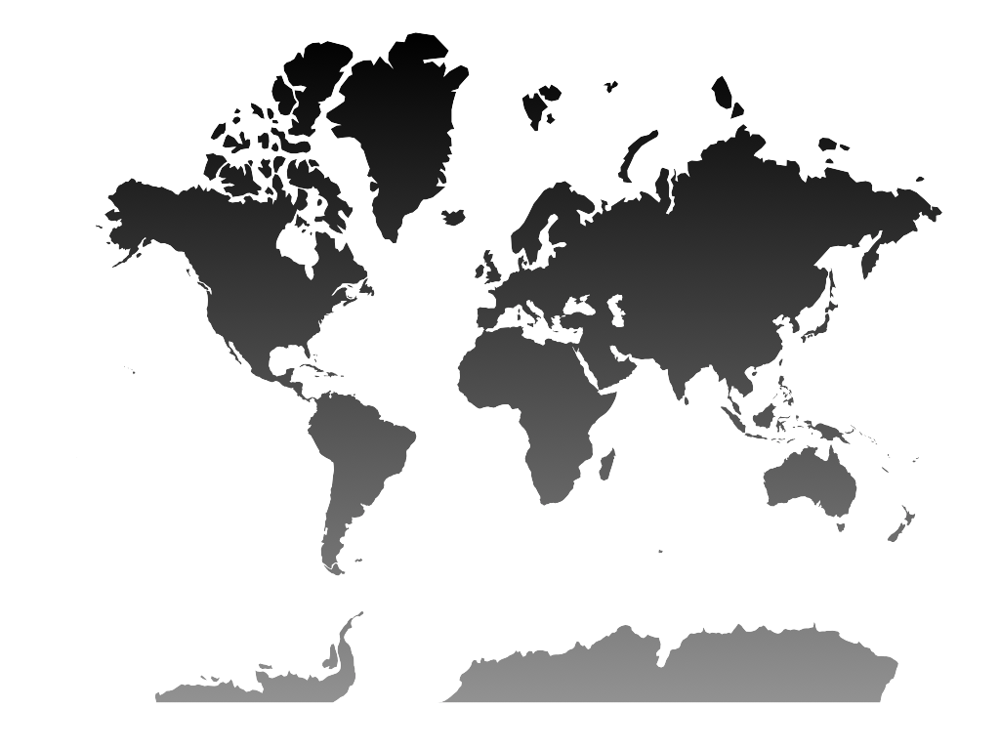
```
]

.right-column[
```{r, echo=FALSE, out.width="55%", fig.align='center'}
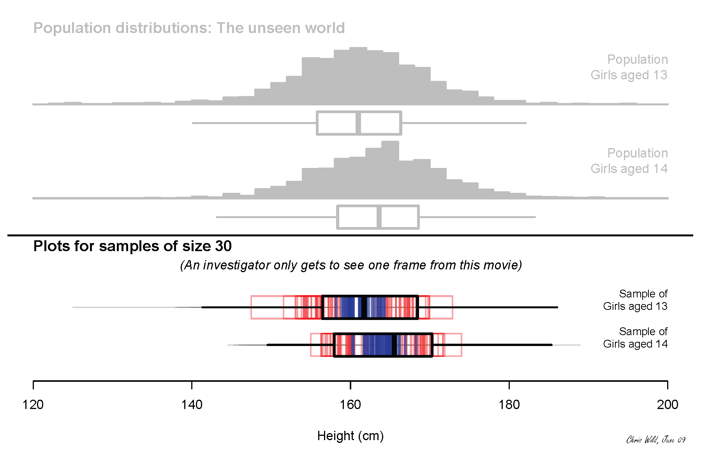
```
]

.footnote[check video for more [BBR1: Biostatistics for Biomedical Research Session 1](https://www.youtube.com/watch?v=x3lV9UWoQwQ&t=2755s)]
---
```{r, echo=FALSE, out.width="70%", fig.align='center'}
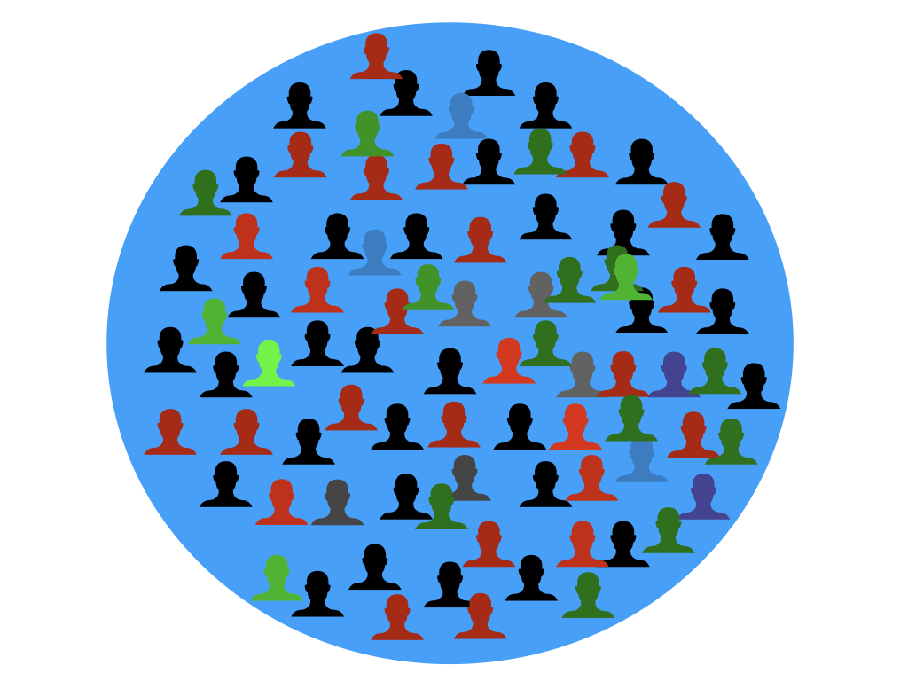
```
---
```{r, echo=FALSE, out.width="70%", fig.align='center'}
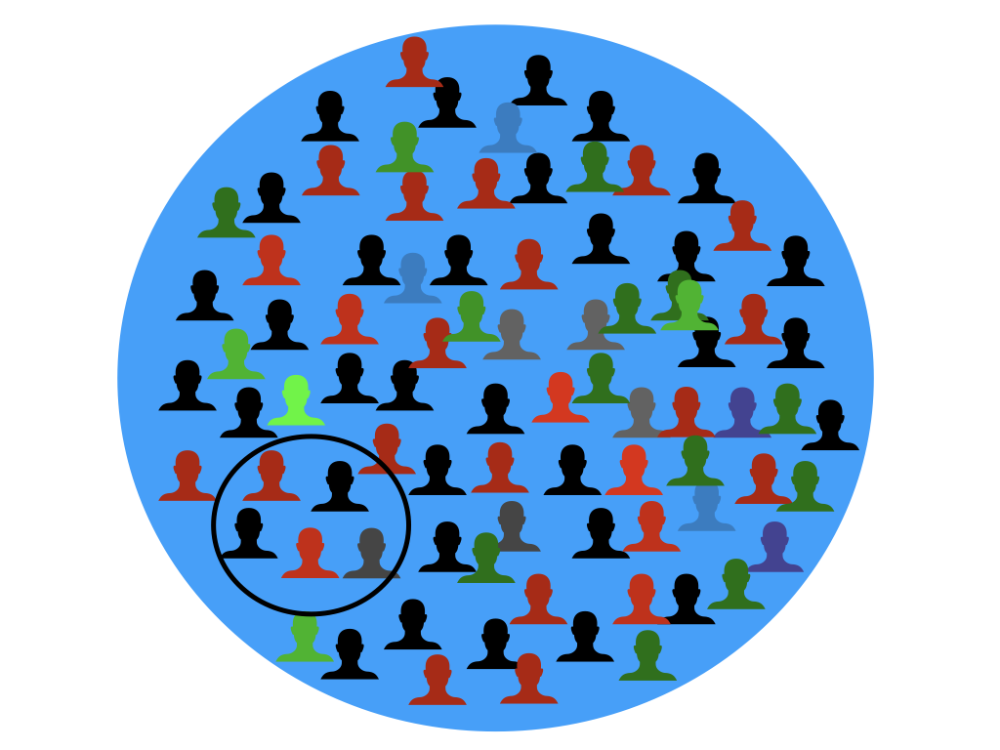
```
---
```{r, echo=FALSE, out.width="70%", fig.align='center'}
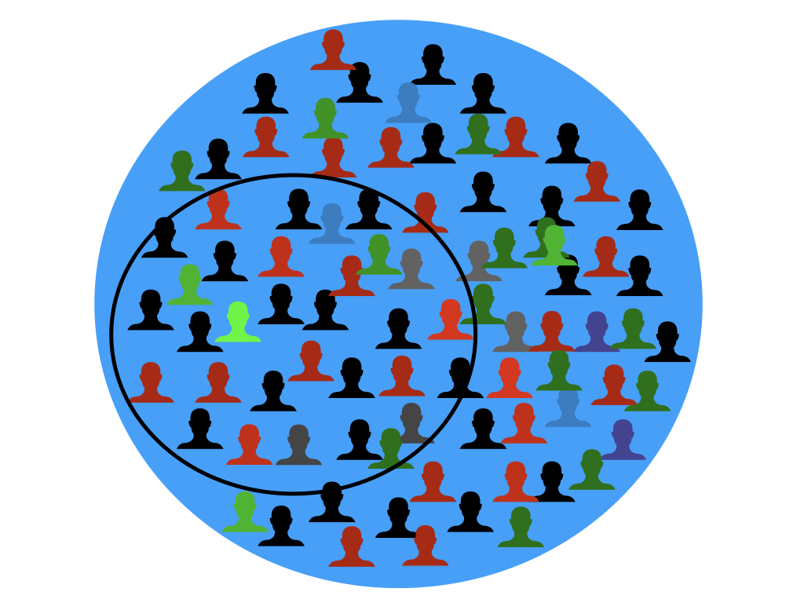
```
---
```{r, echo=FALSE, out.width="70%", fig.align='center'}
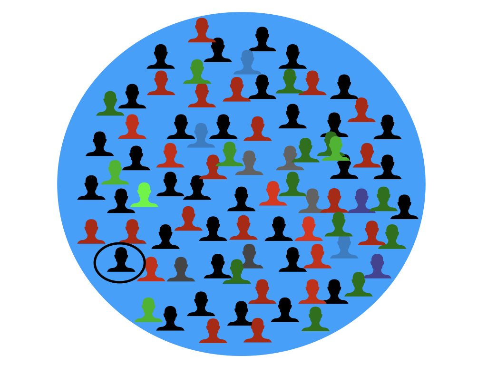
```

---
<center>İstatistiğin farklı tipleri</center>

* **Descriptive (tanımlayıcı):** Ölçümlerini özetler.
  
* **Exploratory:** Ölçümler arasındaki trend-korelasyon-ilişkileri değerlendirip hipotezler/fikirler ortaya koyar
  
* **Inferential (çıkarımsal):** Gözlemimizin, elimizdeki verisetinin ötesine genelleştirilmesi

* **Predictive:** Ölçümlerimizi kullanarak başka kişilerin ölçümlerini tahmin etme

* **Causal:** Bir ölçümü değiştirdiğimizde diğerine ne olduğu

* **Mechanistic:** Sadece etki varlığını değil, bunun nasıl olduğu

.footnote[
The Elements of Data Analytic Style: https://worldpece.org/sites/default/files/datastyle.pdf
]
???
  + Merkezi eğilim (lokasyon)
  + Dağılım (variability)
  
  (Probability distribution) Bir deney için muhtemel farklı sonuçların olabilme ihtimalini veren matematik fonksiyonu
---

```{r, echo=FALSE,out.width="50%", fig.align='center'}
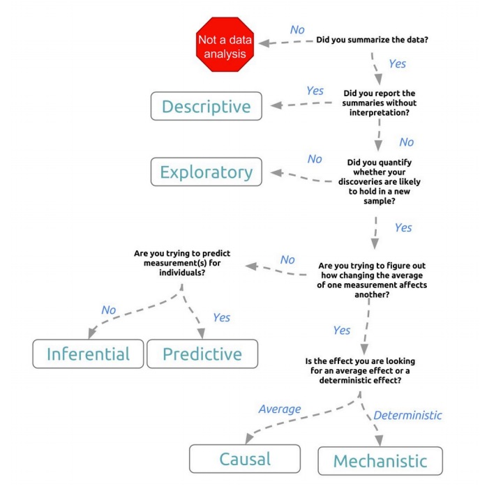
```

.footnote[
The Elements of Data Analytic Style: https://worldpece.org/sites/default/files/datastyle.pdf
]
---
class: center, middle

.pull-left[
İstatistik teorisi

```{r, echo=FALSE,out.width="50%", fig.align='center'}
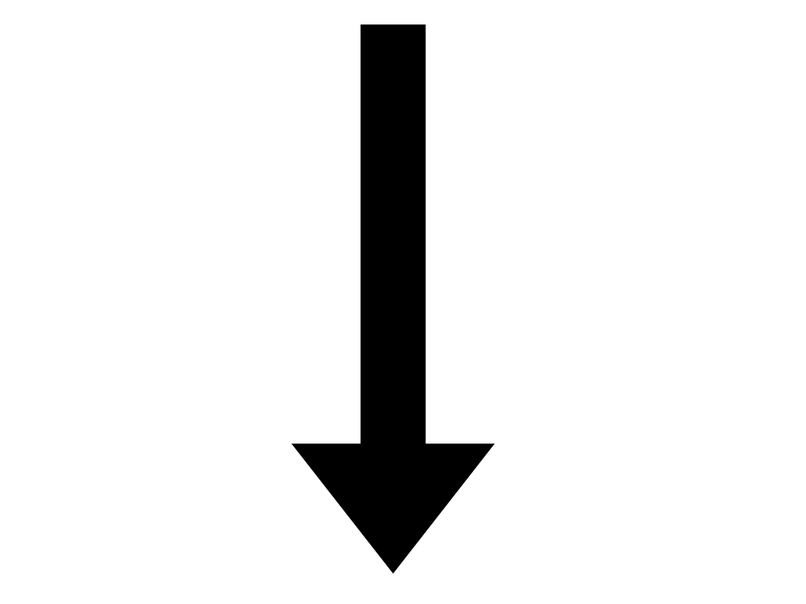
```

Bilimsel ürün
]
--
.pull-left[
Bilimsel ürün mantığı

```{r, echo=FALSE,out.width="50%", fig.align='center'}

```

Bilimsel ürün
]
---
background-image: url(images/keynotes/keynotes.019.png)
background-size: 80%
class: center

.footnote[
[makale: Röhrig B et al.](https://www.ncbi.nlm.nih.gov/pmc/articles/PMC2689572/pdf/Dtsch_Arztebl_Int-106-0262.pdf)
]
---
background-image: url(images/keynotes/keynotes.020.png)
background-size: 75%
class: center
.footnote[
[Wikipedia: Case-Control Study ](https://en.wikipedia.org/wiki/Case%E2%80%93control_study)
]
---
background-image: url(images/types2.jpg)
background-size: 70%
class: center

.footnote[
[kitap: Kestenbaum B, Epidemiology and Biostatistics ](https://www.springer.com/gp/book/9783319966427)
]
---
background-image: url(images/keynotes/keynotes.021.png)
background-size: 80%
class: center
---
class: center, middle


Grup karşılaştırması  

İlişki/Korelasyon  

Tahmin/Prediction  

Geçerlilik/Güvenilirlik  
---
background-image: url(images/keynotes/keynotes.022.png)
background-size: 70%
class: center
.footnote[
[makale: Jaykaran C.](https://www.academia.edu/12523704/How_to_select_appropriate_statistical_test_pdf)
]
---
background-image: url(images/keynotes/keynotes.023.png)
background-size: 75%
class: center

---
background-image: url(images/test_seçimi.jpg)
background-size: 75%
class: center
.footnote[
[kaynak: aliguner.com](https://www.aliguner.com/testsecimi/)
]
---
background-image: url(images/test_seçimi2.jpg)
background-size: 70%
class: center
.footnote[
[kaynak: aliguner.com](https://www.aliguner.com/testsecimi/)
]
---
class: center, middle

# ödev: HİPOTEZ!!  
--
<u>next</u>   
veri tipleri,  
literature search,  
p ye giriş
---